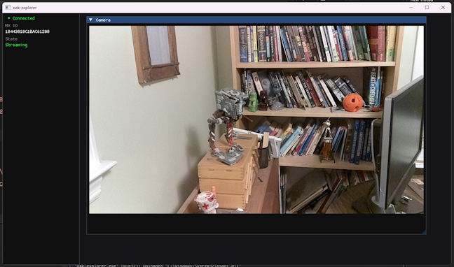

# oak-explorer

A C++ learning harness for the [Luxonis OAK-D-Lite](https://shop.luxonis.com/products/oak-d-lite) depth camera.

Built with ImGui + OpenGL3 + GLFW. The goal is to build up a single growing application across six stages, understanding every line rather than copying demo code.

---

## Stages

| Stage | Name | Status |
|---|---|---|
| 1 | Foundation — ImGui window, device detection sidebar | ✅ Complete |
| 2 | Camera Streams — live RGB frame as ImGui texture | ✅ Complete |
| 3 | Depth & Stereo — StereoDepth node, heatmap, depth math | ⬜ Planned |
| 4 | Spatial Data — click pixel → XYZ in metres | ⬜ Planned |
| 5 | CUDA Acceleration — RTX GPU kernels, OpenGL PBO interop | ⬜ Planned |
| 6 | Neural Inference — .blob model on OAK VPU, detection overlays | ⬜ Planned |

---

## Stage 2 — What It Does

- `CameraStream` class builds a depthai pipeline (ColorCamera → XLinkOut), opens the device, and owns the GL texture
- `StreamView` UI panel renders the live frame via `ImGui::Image()`, scaled to fill available width
- Sidebar shows "Streaming" in green when the pipeline is active
- App runs gracefully with no device connected — shows "No stream" placeholder



---

## Stage 1 — What It Does

- GLFW window with OpenGL 3.3 core profile context
- ImGui docking layout (requires ImGui docking branch — see below)
- Fixed sidebar showing:
  - Green/red connection indicator
  - Device MX ID
  - Boot state: "Unbooted (ready)" or "Booted / in use"
- `OakDevice` wrapper that polls `dai::XLinkConnection::getAllConnectedDevices()` once per second (throttled — USB enumeration costs ~200ms)


---

## Reference Documentation

Standalone HTML files — open directly in a browser, no server needed.

| File | Contents |
|---|---|
| [`docs/reference/oak-reference.html`](docs/reference/oak-reference.html) | Timeless concepts: pipeline mental model, node types, data flow, 6-stage overview |
| [`docs/reference/oak-stage1.html`](docs/reference/oak-stage1.html) | Stage 1 deep-dive: what we built, annotated code, all gotchas encountered |
| [`docs/reference/oak-stage2.html`](docs/reference/oak-stage2.html) | Stage 2 deep-dive: pipeline boot, ColorCamera node, GL texture lifecycle, gotchas |

---

## Dependencies

| Dependency | Version | Notes |
|---|---|---|
| [depthai-core](https://github.com/luxonis/depthai-core) | 2.32.0 | Prebuilt Windows binaries required. v2.17.3 and earlier lack `libusb-1.0.dll` on Windows. |
| [GLFW](https://www.glfw.org/) | 3.4 | Prebuilt Win64 binaries |
| [Dear ImGui](https://github.com/ocornut/imgui) | docking branch | **Must be the `docking` branch** — master/release zips do not include `DockSpaceOverViewport` |
| CMake | 3.20+ | |
| Visual Studio 2022 | | C++17, MSVC |

---

## Building on Windows

### 1. Get the prebuilt dependencies

**depthai-core v2.32.0:**
Download the Windows prebuilt from the [depthai-core releases](https://github.com/luxonis/depthai-core/releases) page and extract to a known path (e.g. `E:\luxonis\depthai-win64\`).

**GLFW 3.4:**
Download the 64-bit Windows binaries from [glfw.org/download](https://www.glfw.org/download.html) and extract to a known path (e.g. `E:\luxonis\glfw-win64\`).

### 2. Clone this repo

```bash
git clone https://github.com/AlfredBr/oak-explorer.git
cd oak-explorer
```

### 3. Get ImGui docking branch

```bash
cd third_party
curl -L "https://github.com/ocornut/imgui/archive/refs/heads/docking.zip" -o imgui-docking.zip
# Extract and rename the folder to: third_party/imgui/
```

### 4. Edit CMakePresets.json

Update the paths to match your dependency locations:

```json
"cacheVariables": {
    "depthai_DIR": "C:/path/to/depthai-win64/lib/cmake/depthai",
    "DEPTHAI_WIN64_DIR": "C:/path/to/depthai-win64",
    "GLFW_ROOT": "C:/path/to/glfw-win64"
}
```

### 5. Open in Visual Studio 2022

**File → Open → Folder** (not "Open Solution") — point it at the `oak-explorer` folder.

VS2022 reads `CMakePresets.json` automatically. Select `windows-debug` from the configuration dropdown and build (Ctrl+Shift+B).

> The POST_BUILD step copies depthai's DLLs (including `libusb-1.0.dll`) next to the executable automatically.

---

## Project Structure

```
oak-explorer/
├── src/
│   ├── main.cpp              # GLFW window, OpenGL context, ImGui render loop
│   ├── oak/
│   │   ├── Device.h          # OakDevice interface (USB enumeration, throttled)
│   │   ├── Device.cpp        # depthai device enumeration wrapper
│   │   ├── CameraStream.h    # CameraStream interface (pipeline + GL texture)
│   │   └── CameraStream.cpp  # builds pipeline, owns device + queue + texture
│   └── ui/
│       ├── Sidebar.h         # renderSidebar() declaration
│       ├── Sidebar.cpp       # ImGui sidebar panel (shows Streaming state)
│       ├── StreamView.h      # renderStreamView() declaration
│       └── StreamView.cpp    # ImGui Camera window with ImGui::Image()
├── third_party/
│   └── imgui/                # ImGui docking branch (vendored)
├── CMakeLists.txt
└── CMakePresets.json
```

---

## Key Lessons (Stage 2)

- `setInterleaved(true)` is required for `GL_RGB` — `false` outputs planar CHW (R plane, G plane, B plane) which renders as a 3×3 tiled grayscale grid
- `GL_BGR` is not valid in OpenGL 3.3 core profile — use `ColorOrder::RGB` + `GL_RGB`
- `#include <GLFW/glfw3.h>` not `<GL/GL.h>` — Windows SDK GL.h only covers GL 1.1; mixing it with depthai headers causes WINGDIAPI/APIENTRY redefinition errors
- `glPixelStorei(GL_UNPACK_ALIGNMENT, 1)` before texture creation — RGB rows at 1280px wide are not 4-byte aligned; restore to 4 after
- `glTexImage2D` once at startup (allocates VRAM), `glTexSubImage2D` every frame (updates in place, no reallocation)
- `queue_.reset()` before `device_.reset()` in destructor — release order matters
- `stream.close()` before ImGui/GLFW teardown — GL resources must be freed while the context is still active
- `OakDevice::poll()` must be throttled — USB enumeration costs ~200ms per call; running it every frame kills frame rate
- `imgui.ini` saves docking layout — delete it to reset if windows dock into the wrong panel

---

## Key Lessons (Stage 1)

- `getAllConnectedDevices()` is on `dai::XLinkConnection`, not `dai::DeviceBase`
- ImGui's default font (ProggyClean) is ASCII-only — use `ImGui::Bullet()` not `●`
- ImGui docking requires the `docking` branch — standard releases don't include it
- depthai v2.32.0+ bundles `libusb-1.0.dll`; older versions do not (silent failure on Windows)
- A device in `X_LINK_UNBOOTED` state is healthy and ready — it just hasn't had a pipeline uploaded yet

---

## License

MIT
